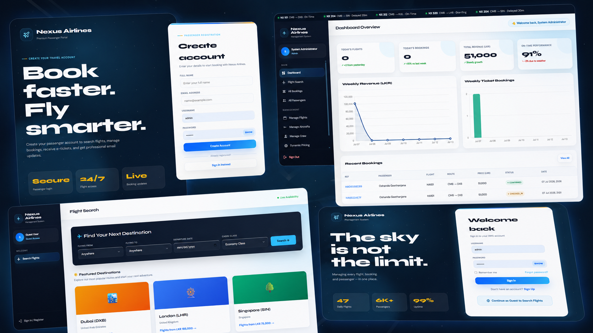

<div align="center">



<br />

# Nexus Airlines Management System

### A premium web-based airline booking and operations management platform

[](https://www.php.net/)
[](https://www.mysql.com/)
[](https://developer.mozilla.org/en-US/docs/Web/JavaScript)
[](#project-status)
[](#source-code-access)

<br />

[Project Overview](#project-overview) · [Core Features](#core-features) · [Technology Stack](#technology-stack) · [Request Access](#source-code-access)

</div>

---

## Project Overview

**Nexus Airlines** is a complete airline management and passenger booking system developed for managing flights, aircraft, crew members, passengers, bookings, ticketing, pricing, notifications, and administrative operations through a modern web interface.

The platform provides separate experiences for passengers and system administrators. It combines a clean responsive interface with secure PHP and MySQL-based backend functionality, real-time booking workflows, administrative analytics, QR-enabled e-tickets, PDF generation, and automated email notifications.

---

## Core Features

### Passenger Portal

- Secure passenger registration and authentication
- Guest flight search access
- Flight search by origin, destination, date, and cabin class
- Live seat availability and seat selection
- Passenger information and booking workflow
- Economy, Business, and First Class booking support
- Dynamic ticket pricing based on demand and departure time
- Secure payment simulation and booking confirmation
- Personal booking history and booking status tracking
- Printable e-ticket with locally generated QR code
- Downloadable PDF ticket
- Passenger profile management
- Loyalty points and rewards module
- Booking cancellation and refund handling
- Password recovery functionality

### Administration Portal

- Premium analytics dashboard with Chart.js
- Flight, booking, revenue, and performance statistics
- Complete flight schedule management
- Aircraft and fleet management
- Crew member and assignment management
- Passenger and booking administration
- Booking status updates
- Dynamic fare and pricing management
- Passenger manifest generation
- Refund processing
- Mail server and SMTP configuration
- Automated passenger and administrator notifications
- Role-based access control

---

## System Modules

| Module | Description |
|---|---|
| Authentication | Passenger registration, login, logout, recovery, and session control |
| Flight Search | Search available flights using route, date, and class filters |
| Booking | Passenger details, seat selection, fare calculation, and confirmation |
| E-Ticketing | QR-enabled digital ticket, print view, and PDF download |
| Dynamic Pricing | Automatic fare adjustments based on time and seat availability |
| Aircraft Management | Fleet records, capacity, status, and maintenance information |
| Crew Management | Crew profiles, roles, availability, and flight assignments |
| Booking Management | Booking records, status changes, cancellations, and refunds |
| Loyalty | Passenger points and loyalty-related benefits |
| Notifications | SMTP email alerts for bookings, status changes, and flight updates |
| Analytics | Revenue, booking, flight, and operational dashboard charts |

---

## Technology Stack

| Layer | Technologies |
|---|---|
| Frontend | HTML5, CSS3, Vanilla JavaScript |
| Backend | PHP 8+, PDO, Sessions |
| Database | MySQL / MariaDB |
| Charts | Chart.js |
| Alerts | SweetAlert2 |
| Email | PHPMailer with configurable SMTP |
| PDF Generation | Dompdf |
| Ticket Verification | Locally generated QR codes |
| Server Environment | Apache via XAMPP, WAMP, or Laragon |

---

## Security and Reliability

- Password hashing using PHP password functions
- PDO prepared statements for database operations
- Session-based authentication and authorization
- Role-based page protection
- Input validation and output escaping
- Unique booking references
- Duplicate seat booking prevention
- Protected administrative functions
- Configurable SMTP credentials

---

## Interface Preview

The cover image presents the main passenger registration, login, flight search, and administration dashboard interfaces included in the system.

> Add the project cover image to the repository using this exact path:
>
> `assets/nexus-airlines-cover.png`

---

## Repository Contents

```text
nexus-airlines-management-system/
├── assets/
│   └── nexus-airlines-cover.png
├── source/
│   └── nexus-airlines-project.zip
├── README.md
└── LICENSE
```

The complete project archive inside the `source` directory is password protected to prevent unauthorized copying and redistribution.

---

## Source Code Access

The project source code is not publicly accessible without permission.

For academic review, portfolio evaluation, collaboration, customization, or legitimate project-related inquiries, send an access request using one of the options below.

<div align="center">

[](mailto:oshanda@whitecoder.online?subject=Nexus%20Airlines%20Project%20Access%20Request&body=Hello%20Oshanda%2C%0A%0AI%20would%20like%20to%20request%20access%20to%20the%20Nexus%20Airlines%20project.%0A%0AName%3A%0APurpose%3A%0AGitHub%20Profile%20or%20Organization%3A%0A%0AThank%20you.)

[](https://wa.me/94788778100?text=Hello%20Oshanda%2C%20I%20would%20like%20to%20request%20access%20to%20the%20Nexus%20Airlines%20project.)

</div>

### Include these details in your request

```text
Name:
Purpose of requesting the project:
Institution / Company:
GitHub profile or website:
Required use or customization:
```

Access approval is provided manually. The archive password will not be published in this repository.

---

## Usage Notice

This repository is provided as a portfolio showcase and project demonstration.

- Do not copy, resell, redistribute, or republish the protected source code without written permission.
- Do not remove original credits or present the project as your own work.
- Commercial use, client deployment, modification, and redistribution require prior approval.
- Access to the archive does not automatically grant ownership or redistribution rights.

---

## Project Status

**Completed and available for demonstration, review, and approved customization requests.**

---

## Contact

<div align="center">

**Oshanda Geethanjana**  
Full Stack Developer · Founder of WhiteCoder

[Portfolio](https://oshanda.com) · [GitHub](https://github.com/oshandageethanjana) · [Email](mailto:hello@oshanda.com) · [WhatsApp](https://wa.me/94788778100)

<br />

Developed and presented under **WhiteCoder**

</div>
